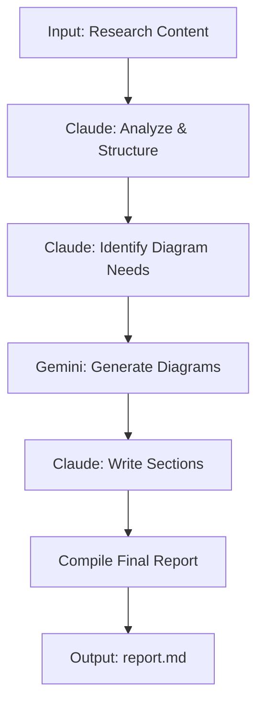

# MAW Report Generator

Generate professional reports with auto-generated diagrams from your research content.

## Features

- **Multi-AI Collaboration**: Claude plans structure, Gemini generates diagrams
- **Smart Diagram Generation**: Auto-detects where figures would enhance content
- **Fallback Support**: Uses Mermaid diagrams when image generation is unavailable
- **Professional Output**: Academic/professional style Markdown reports

## Quick Start

```bash
# Generate report from content
python report_generator.py --topic "My Research Topic" --content "Your research content..."

# Generate from file
python report_generator.py --topic "AI Architecture" --content-file research.txt --output report.md

# Generate single diagram
python report_generator.py --diagram-only "System architecture showing client, server, and database"
```

## Output

- Markdown report with sections, diagrams, and conclusion
- Mermaid diagrams embedded (renders in GitHub, VS Code, etc.)
- Image files when native generation available

## Workflow


